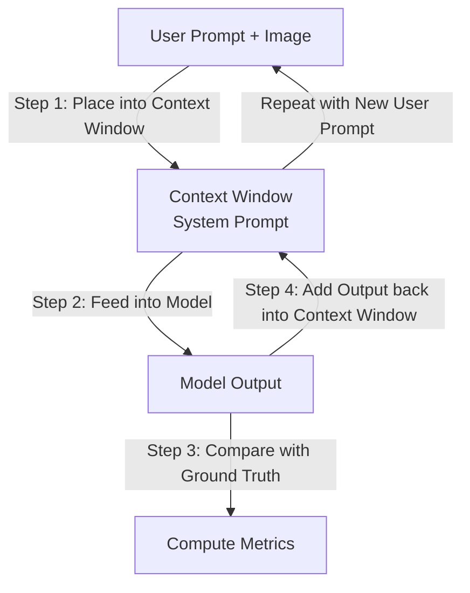

# LLaVA Finetune

Fine-tuning LLaVA Vision and Language Models to enhance domain-specific performance and general multimodal understanding.

## Core Features

- 🧠 Fine-Tuning with LoRA
  - Reduces computational cost while maintaining high performance using **PEFT**.
- 📊 Multimodal Benchmarks
  - Evaluated on benchmarks like MME, MMBench, MMMU, POPE and AI2D.
- 📂 Dataset
  - Supports multi-turn conversational datasets and domain-specific data for fine-tuning.
- ⚖️ Comparative Analysis
  - Benchmarked against pretrained models like LLaVA-1.5, LLaVA-Next, and LLaVA-OneVision to highlight trade-offs between specialization and generalization.

## Techniques & Framework

- Multi-turn Visual Instruction Tuning
- Multi-turn Conversation Inference
- LoRA
- QLoRA
- SDPA
- Fused AdamW
- Liger Kernel
- VLMEvalKit
- DDP

## Model

- LLaVA v1.5 7B
- LLaVA NEXT (LLaMA 3) 8B
- LLaVA OneVision 7B

## Multi-turn Conversation Architecture

